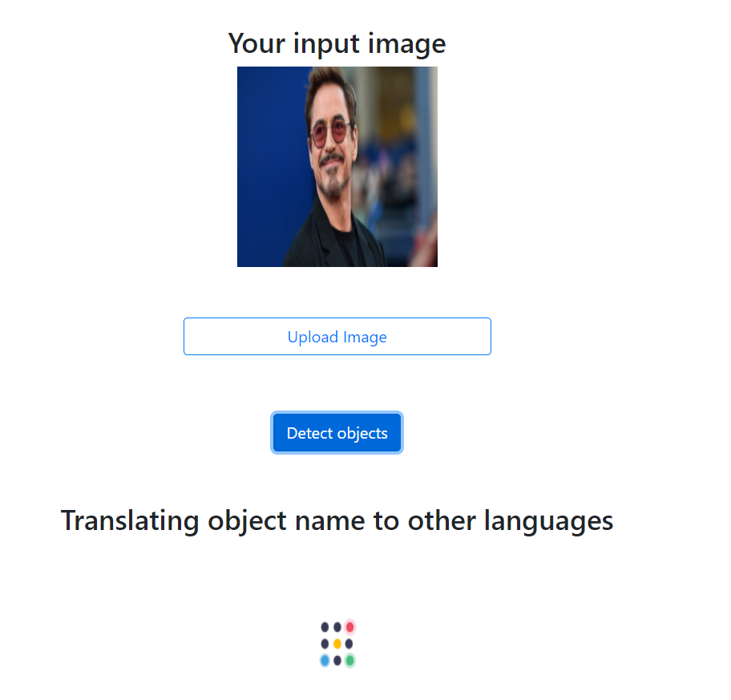

<h1 align="center" background-color=#021d44>
   
  
   
  AI Gallery
   
</h1>

<h4 align="center">An in-browser AI playground</h4>

AI Gallery is the ultimate place to enjoy exciting AI features. In the 21st century, literally everything can be combined with AI. We had a similar idea. We built AI Gallery to show how simple features meshed up with AI become extraordinary.

Head over to http://aigallery.design/ and enjoy the power of AI!

  <a href="#key-features">Key Features</a> •
  <a href="#try-now">Try Now</a> •
  <a href="#how-to-use-in-development-environment">How To Use</a> •
  <a href="#credits">Credits</a> •
  <a href="#license">License</a>

## ✔️ Key Features

### 🔄 Memeswap

Ever imagined how your face on someone else's neck would look? Well you can just try Memeswap and see how it goes!
Memeswap is a face swapper powered by AI. We wanted to make it fun. There are multiple memes available already, just hit swap and see the magic. 
Share memes with your friends but with your face instead!

* Upload a portrait image, get back a random meme faceswapped with your uploaded face

 

### 🌐 Object Translator

Out of thousands of language around the world, we can only speak one or two(even more if you are a ninja!). Ever wondered what a particular thing is called in other languages? 
Introducing object translator. Upload literally anything and let AI tell what its called in other langauges. 

* Upload an image with generally one object (a picture of a dog, two dogs or three), get back the object's name in many different languages

 

### 🎨 Style Transfer

You can be Picasso! or Da Vinci or Salvador Dali. 
You can be the artist. Upload your picture along with the style you love and let AI mix that for you. The output you get is an artistic painting you always wanted to  paint yourself. 

* Upload a content image and a style image and let our application paint your content image with the styles in your style image

  

### ➕...More in construction

## 🖼️ Try Now
Visit http://aigallery.design/
Click on the feature you wish to try

## 📋 How To Use in Development Environment

Want to get a taste of development? Follow these steps and get it up and running locally. We also love contributions, if there is any feature you'd like to see create an issue or send a PR if you already coded something. 

1. Type "pip install -r requirements.txt"
4. Type "flask run"
5. Open browser and navigate to "127.0.0.1:5000"
6. Open new command prompt in /client/image-ml
7. Ensure you have React installed
8. Type "npm install"
9. Type "npm start"

## 🙌 Credits

This software uses the following open source packages:

- README layout https://github.com/amitmerchant1990/electron-markdownify

- Faceswap feature: https://github.com/wuhuikai/FaceSwap [1](https://github.com/wuhuikai/FaceSwap/issues/28)

## 📝 License

MIT

---
